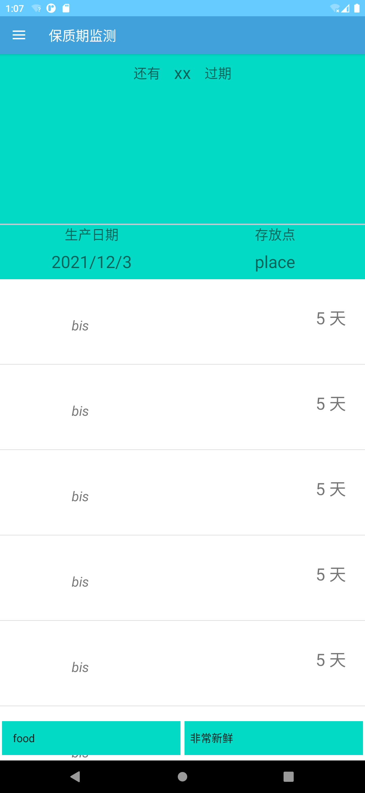

# FoodSave 2.0ver

> 程序概述

- 程序主要分为两大部分，一是界面部分，因为开发周期有限以及参考程序极少，因此我们判断只需要一个主界面（用于显示所有已录入物品信息）和一个添加界面（用于添加新入物品，可在此界面添加拍照录入或语音录入功能）；二是数据库部分，这部分有两种方案：一是使用手机本地的SQLite数据库进行存储，该方案的好处为简单易行，程序无需联网，增加了安全性；缺点为无法共享数据，程序仅能单人使用，在家庭场景下不易使用；二是使用服务器提供的数据库，由服务器进行数据的更新及收发处理，该方案适用性更广泛，但开发过于繁琐。因此我们选择第一种本地数据库作为第一阶段开发目标。

>开发环境（Develop Environment)

- 运行环境：Android Studio 集成开发环境，Android SDK 30, jdk 1.8
- 使用语言：java
- 使用数据库：SQLite, Room 2.2.5ver

> 0.27ver 
> 统一了所有字体 
> 统一了所有文字命名并存储于chinese_strings.xml中 
> 更新主界面底部上拉选择框 

>2.0ver 
>是的我们跳版本了 
>我们决定让版本号不断逼近自然底数e 
>目前完善了主界面的SaveAdapter的一部分工作，ta至少能显示了 
>让SearchThread有了剩余时间计算功能 
>save_item中添加了@Ignore Long 类型的 "left_time" 数据 
>为什么没加进数据库？在尝试更新数据库导致一个AVD Manager崩溃后我们选择放弃。 
>将 header.xml 的 constraintLayout 修改为 relativeLayout，这很重要，因为只有这样 RecyclerView 才能实现滑动

>还要做什么
>>完善主界面的SaveAdapter,实现储物的显示 
>>完成添加页面 
>>完善侧边栏与底部选择框的功能 

>示例图片

>@ZUCC 计算学院 计科1903